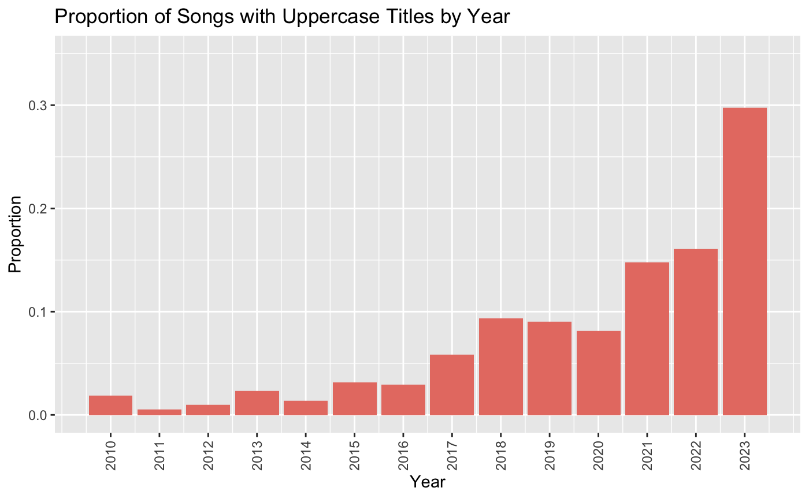
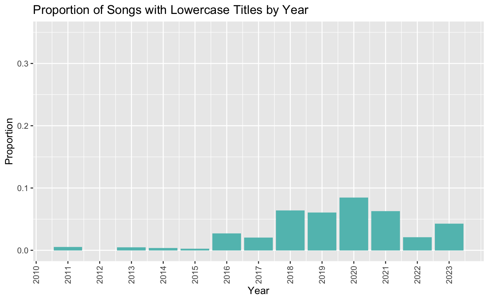
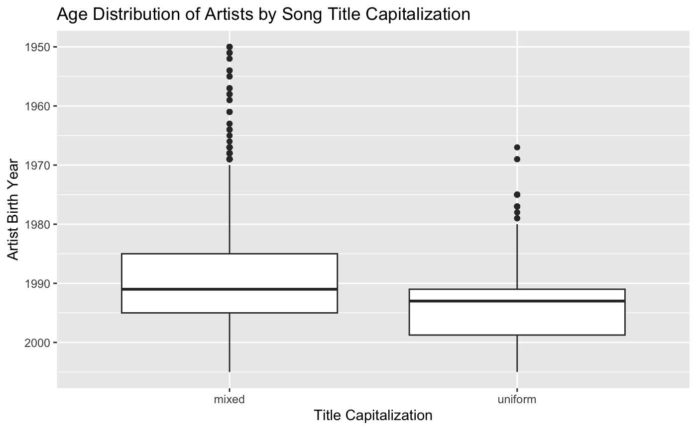
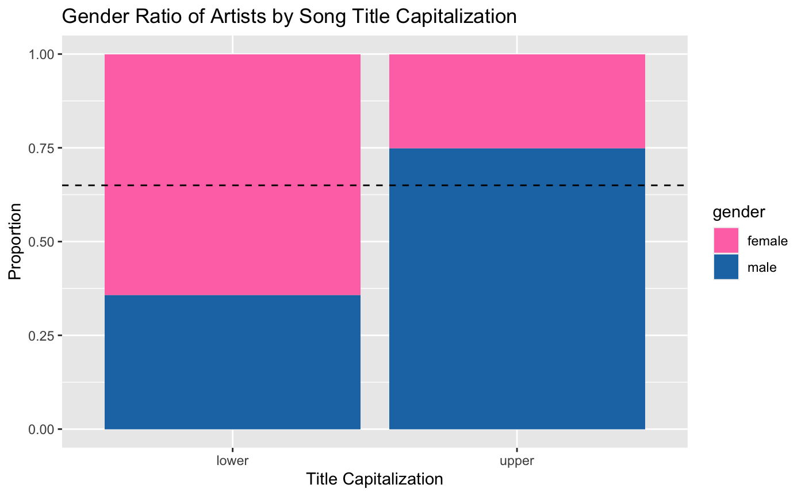
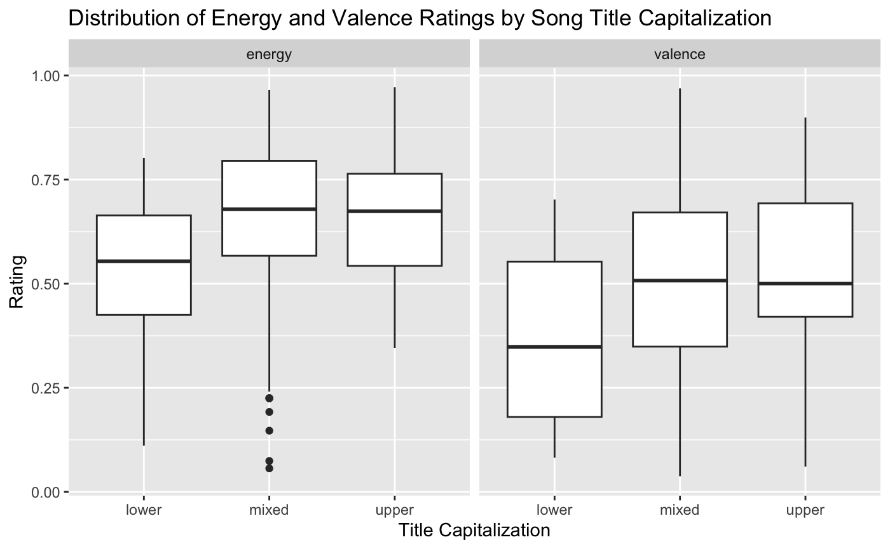

# Trends in Song Title Capitalization
## Background
In popular music, song titles typically follow [Title Case Capitalization](https://apastyle.apa.org/style-grammar-guidelines/capitalization/title-case). This involves capitalizing the first letter of each word except for "minor" words, like articles and prepositions. However, there has been a recent trend of artists using non-standard capitalization in their titles, often with uniform capitalization: either all-caps (e.g. SICKO MODE, HUMBLE., THATS WHAT I WANT) or all-lowercase (e.g. bad guy, drivers license, greedy). 

Several articles have written about this trend and have noticed some interesting patterns. Firstly, most observe that it is particular to young, typically Gen Z artists. The general explanation is that since Gen Z artists grew up with digital media and texting, they are accustomed to using capitalization to express tone and mood, and thus choose to use these in their song titles ([1](https://www.washingtonpost.com/entertainment/music/willow-olivia-rodrigo-billie-eilish-lowercase-letters/2021/10/08/1aecbb2a-2767-11ec-8d53-67cfb452aa60_story.html), [2](https://qz.com/quartzy/1690992/the-rise-of-the-all-caps-song)). Secondly, some notice a gender difference in song titling, with male artists opting for uppercase titles and female artists opting for lowercase [(3)](https://www.vice.com/en/article/y3z45v/internet-lowercase-spelling-taylor-swift-charli-xcx). This could also be the effect of [similar trends in texting language](https://www.bustle.com/entertainment/men-text-women-lowercase-boy-dating), or might just reflect typical gender norms. Lastly, perhaps the most interesting observation is that the capitalization of a song's title should reflect its subjective qualities, like the overall mood, emotion, energy, or strength. For instance, perhaps songs with uppercase titles might feel more boisterous or triumphant, whereas songs with lowercase titles might feel more delicate or vulnerable [(4)](https://qz.com/quartzy/1690992/the-rise-of-the-all-caps-song).

Unfortunately, there is not a lot of numerical evidence for these patterns yet. While it will be difficult to evaluate them completely, my goal is to determine whether or not they are reflected in popular song data.
## Questions
*Is this trend particular to Gen Z artists?*

If the trend of using uniform-case titles is particular to Gen Z artists, the expectation is that artists who use uniform-case titles should be born relatively recently (typically late 90’s and after).

*Is there any relationship between artist gender and capitalization?*

If the patterns observed in the article are correct, then I would expect to find the following:
1. Female artists are more likely to use lowercase titles than male artists
2. Male artists are more likely to use uppercase titles than female artists

*Does a song title’s capitalization say anything about the song’s subjective qualities?*

This question is probably the most difficult to answer, as it’s very difficult to numerically define a song’s subjective qualities like mood or energy. For this study, I use the Spotify API to collect the songs’ audio features, which include measurements such as energy, and valence. While these are not perfect (and by my own standards, not very accurate), in aggregate they should theoretically reflect expected patterns in a song’s subjective qualities.

There are several audio features that could be analyzed, but for the purpose of this study I will only examine energy and valence (how positive or negative a song sounds), as I believe these two features should best represent a song’s overall mood.

If the patterns observed in the article are correct, I would expect that songs with uppercase titles should be rated relatively high in energy and valence, whereas songs with lowercase titles should be rated relatively low.
## Data
This study involves two datasets:
- One containing over 8,000 songs released in 2010-2023
- One containing the Billboard Year-End Hot 100 songs from 2000-2022 (a total of 2,300 songs), as well as audio features for each song.

Each dataset includes information about the song's title, artist (age and gender), and release year. However, only the second one has data on audio features. Thus, the first dataset will be used to analyze trends relating to age and gender; the second for trends relating to audio features.
## Results
### Overall trend

It is clear that the trend of using uniform-case titles started to become popular around 2016. Uppercase titles have always existed in a minority, as songs with acronyms as titles (e.g. E.T., OMG, GDFR) are uppercase. However, they did not appear to increase in popularity until 2016, when lowercase titles also began to appear. Since then, uniform-case titles have comprised over 15% of popular song titles (nearly 35% for songs released in 2023).
### Effect of birth year

Unsurprisingly, I found that uniform-case titles were typically written by younger artists. (t = -14.56, p < 0.001). When selecting uniform-case songs, the mean birth year of artists is around 1993; for mixed-case songs, it is around 1989. However, while it is clear that younger artists are driving this trend, the year 1993 is surprisingly early: if the trend were particular to Gen Z, the year should have been much more recent (late 90's or early 2000's).
### Effect of gender

As expected, songs with lowercase titles were disproportionately written by female artists, and songs with uppercase titles were disproportionately written by male artists (X-squared = 95.046, p < 0.001). While about 65% of all songs were written by male artists, less than 30% of lowercase titles and nearly 75% of uppercase titles were written by male artists.
### Relationship with audio features

As expected, songs with lowercase titles were ranked relatively lower in energy (t = -4.654, p < 0.001) and lower in valence (t = -4.032, p < 0.001). The average energy ranking of songs with lowercase titles was about 0.13 points lower than others, and the average valence ranking was about 0.14 points lower. In theory, this should suggest that songs with lowercase titles are generally less energetic and less positive.

However, contrary to expectations, there was no significant difference in rankings between songs with uppercase titles and others. In theory, this would suggest that songs with uppercase titles do not noticeably differ from typical songs in terms of energy and positivity.
